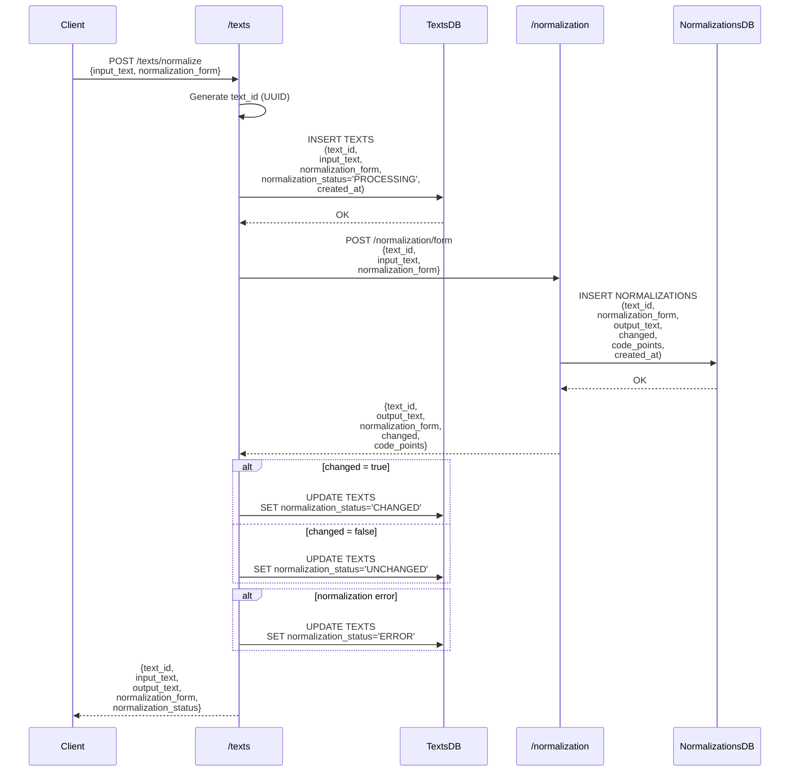

```mermaid
sequenceDiagram
    participant Client
    participant TextsAPI as /texts
    participant TextsDB
    participant NormAPI as /normalization
    participant NormalizationsDB

    Client->>TextsAPI: POST /texts/normalize<br/>{input_text, normalization_form}

    TextsAPI->>TextsAPI: Generate text_id (UUID)

    TextsAPI->>TextsDB: INSERT TEXTS<br/>(text_id,<br/>input_text,<br/>normalization_form,<br/>normalization_status='PROCESSING',<br/>created_at)
    TextsDB-->>TextsAPI: OK

    TextsAPI->>NormAPI: POST /normalization/form<br/>{text_id,<br/>input_text,<br/>normalization_form}

    NormAPI->>NormalizationsDB: INSERT NORMALIZATIONS<br/>(text_id,<br/>normalization_form,<br/>output_text,<br/>changed,<br/>code_points,<br/>created_at)
    NormalizationsDB-->>NormAPI: OK

    NormAPI-->>TextsAPI: {text_id,<br/>output_text,<br/>normalization_form,<br/>changed,<br/>code_points}

    alt changed = true
        TextsAPI->>TextsDB: UPDATE TEXTS<br/>SET normalization_status='CHANGED'
    else changed = false
        TextsAPI->>TextsDB: UPDATE TEXTS<br/>SET normalization_status='UNCHANGED'
    end

    alt normalization error
        TextsAPI->>TextsDB: UPDATE TEXTS<br/>SET normalization_status='ERROR'
    end

    TextsAPI-->>Client: {text_id,<br/>input_text,<br/>output_text,<br/>normalization_form,<br/>normalization_status}
```
